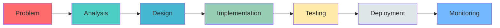

# 👋 Hey there! I'm Arpit Satpute

<div align="center">
  
  
  
  [](https://www.linkedin.com/in/arpitsatpute)
  [](https://twitter.com/arpits_jsx)
  [](https://leetcode.com/u/Arpit_Ramesh_Satpute/)
  [](https://github.com/arpitSatpute)
  
</div>

---

## 🚀 About Me

```javascript
const arpit = {
    pronouns: "He/Him",
    code: ["Solidity", "JavaScript", "Java", "Python", "SQL"],
    technologies: {
        blockchain: {
            smart_contract: ["Solidity", "Foundry", OpenZeppelin],
            token_standards: ["ERC20", "ERC721", "ERC712", "ERC1155", "ERC4626"],
            web3_frontend: ["Wagmi", "Viem", "Ethers.js",],
            decentralised_storage: ["IPFS"],
            others: ["Self SDK (ZKP)", Polygon (Layer 2)]
        },
        backEnd: {
            java: ["Spring Boot", "Microservices", "Hibernate"],
            js: ["Node.js", "Express"],
        },
        frontEnd: {
            js: ["React", "React Native", "Next.js", "JavaScript", "TypeScript"],
            css: ["Tailwind", "Bootstrap"]
        },
        databases: ["MongoDB", "MySQL", "PostgreSQL", "Redis"],
        devOps: ["Docker", "Git"],
        tools: ["Postman", "Maven", "IntelliJ IDEA"]
    },
    currentFocus: "Engineering high-performance, scalable Web3 applications leveraging advanced blockchain architectures",
    funFact: "I debug with console.log() and I'm not ashamed!"
};
```

---

## 💻 Tech Stack

<div align="center">

### Languages


### Frameworks & Libraries


### Databases


### Tools & Platforms


</div>

---

## 📊 GitHub Stats
<div align="center">
  
  
  
  
</div>

<div align="center">
  
  
  
  
</div>

---

## 🎯 Project Timeline

> A chronological journey through my development projects

### 🌟 [Vermint](https://github.com/arpitSatpute/Vermint)
**📅 Created: [Add Date]** | 

```yaml
Description: ["Decentralized e-commerce platform where brands mint NFT digital twins of physical products, enabling trust-less purchases, escrow security, and real-world redemption via on-chain verification."]
Tech Stack:
  - Technology: Blockchain
  - Frontend: React, JavaScript, Wagmi/Viem
  - Smart Contract: Solidity, Foundry, Openzeppelin
  - Decentralised Storage: Pinata IPFS
  - Token Standards: ERC1155
Key Features:
  - ✨ Decentralized e-commerce platform where brands mint ERC1155 NFTs as tamper-proof digital twins of real-world products,
  - ✨ Smart Contracts (NFT + Escrow + Order Manager) with secure minting, trust-less payments, conditional fund releases, and automated redemption workflows.
  - ✨ Integrated IFS for immutable product provenance and on chain redemption tracking with dynamic NFT metadata evolution.
```

[](https://github.com/arpitSatpute/Vermint)

---

### 📅 [Skedula](https://github.com/arpitSatpute/Skedula)
**📅 Created: [Add Date]** | 

```yaml
Description: Centralised Portal for Appointment and Business Management.
Tech Stack: 
  - Frontend: React, Tailwind CSS
  - Backend: Spring Boot, Java, Razorpay, UploadCare
  - Database: PostgreSQL, Redis
  - Other: Docker, RabbitMQ
Key Features:
  - 📆 Full-stack platform enabling businesses to host services & manage appointments.
  - 🔔 Razorpay wallet (add/withdraw) with secure transactions with robust encryption.
  - 📊 Containerised with Docker & deployed to cloud, ensuring high availability.
```

[](https://github.com/arpitSatpute/Skedula)

---

### 📈 [Insight Yield](https://github.com/arpitSatpute/Insight-Yield)
**📅 Created: [Add Date]** | 

```yaml
Description: Autonomous DeFi liquidity engine that harnesses off-chain predictive intelligence and on-chain cryptographic proofs to continuously redirect capital toward the highest-yielding opportunities.
Tech Stack: 
  - Technology: Blockchain
  - Frontend: React, JavaScript, Wagmi/Viem, Heroui
  - Smart Contract: Solidity, Foundry, Openzeppelin
  - Backend: Python (Allocation Prediction Model)
  - Token Standards: EIP712, ERC20, ERC4626
Key Features:
  - 📊 Designed a modular ERC-4626 Vault system on Polygon enabling automated yield strategies and composable integration with DeFi protocols. 
  - 🤖 Built a custom Python AI engine performing real-time risk scoring, APY prediction, and optimal allocation generation using XBoost models.
  - 🚀 Implemented an EIP-712 verification flow ensuring all Al recommendations are authenticated and tamper-proof on chain.
```

[](https://github.com/arpitSatpute/Insight-Yield)

---

### 📝 [PlanIt](https://github.com/arpitSatpute/PlanIt)
**📅 Created: [Add Date]** | 

```yaml
Description: Event Management Platform
Tech Stack: 
  - Frontend: React, JavaScript
  - Backend: Spring Boot, Java
  - Database: PostgreSQL
  - Other: Docker, RabbitMQ
Key Features:
  - 👥 Platform enabling hosts to connect with event organizers and local vendors across cities.
  - 📋 Dual booking system, allowing direct organizer hiring or selection from available vendors.
  - 🔄 Secure escrow system, holding 10% of payments until post-event review.
```

[](https://github.com/arpitSatpute/PlanIt)

---

### 🚀 [Proxima](https://github.com/arpitSatpute/Proxima)
**📅 Created: [Add Date]** | 

```yaml
Description: AI-Powered Exam Integrity System 
Tech Stack: 
  - Frontend: React, React Native, JavaScript, Tailwind CSS
  - Backend: Java, Spring Boot, WebRTC, WebSocket, Gemini AI
  - Database: PostgreSQL
Key Features:
  - 🎨 AI-driven exam system, securing 10+ assessments with real-time monitoring.
  - ⚡ Bluetooth & WiFi-based device detection, blocking exam if unauthorised devices detected.
  - 🔒 AI-generated scenario-based tests aligned with resumes and job descriptions.
```

[](https://github.com/arpitSatpute/Proxima)

---

## 🏗️ Other Notable Projects

<table>
<tr>
<td width="50%">

### 🎯 Quiz Application
**Microservices Architecture**

A scalable quiz platform built with:
- Spring Boot Microservices
- FeignClient for service communication
- RESTful API design
- Distributed system patterns

[](https://github.com/arpitSatpute/Quiz)

</td>
<td width="50%">

### 💾 Redis Integration
**Caching Solution**

Implementation of Redis for:
- High-performance caching
- Session management
- Real-time data access
- Performance optimization

[](https://github.com/arpitSatpute/Redis)

</td>
</tr>
</table>

---

## 📈 Contribution Activity

<div align="center">
  
  
  
</div>

<div align="center">
  
  
  
  
  
</div>

---

## 🎯 Current Focus

- 🔭 Building **full-stack applications** with modern tech stacks
- 🌱 Mastering **microservices architecture** and **distributed systems**
- 👯 Contributing to **open-source projects**
- 💡 Exploring **cloud technologies** (AWS, Docker, Kubernetes)
- 📚 Learning **system design** and **scalability patterns**
- ⚡ Fun fact: **I believe in writing code that speaks for itself!**

---

## 💼 What I Bring to the Table



---

## 📫 Let's Connect!

<div align="center">
  
  💬 I'm always open to interesting conversations and collaboration opportunities!
  
  [](https://www.linkedin.com/in/arpit-satpute)
  [](https://twitter.com/arpitsatpute)
  [](https://leetcode.com/arpitsatpute)
  [](mailto:arpitrameshsatpute6986@gmail.com)
  
</div>

---

<div align="center">
  
  ### 💭 Developer Quote
  
  
  
  ---
  
  ### 📊 This Week's Coding Stats
  
  <!--START_SECTION:waka-->
  <!--END_SECTION:waka-->
  
  ---
  
  **⭐ From [arpitSatpute](https://github.com/arpitSatpute)**
  
  
  
  
  *"First, solve the problem. Then, write the code."* – John Johnson
  
</div>
